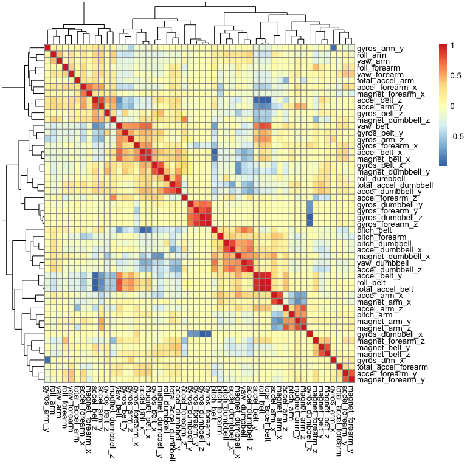

Predicting Exercise Technique Using Random Forest Algorithms
================
Kenen Corea
2023-11-17

## Abstract

The following is my submission for the Practical Machine Learning course
project under John Hopkins University’s Data Science Specialization. The
prompt is as follows:

> “Using devices such as Jawbone Up, Nike FuelBand, and Fitbit it is now
> possible to collect a large amount of data about personal activity
> relatively inexpensively. These type of devices are part of the
> quantified self movement – a group of enthusiasts who take
> measurements about themselves regularly to improve their health, to
> find patterns in their behavior, or because they are tech geeks. One
> thing that people regularly do is quantify how much of a particular
> activity they do, but they rarely quantify how well they do it. In
> this project, your goal will be to use data from accelerometers on the
> belt, forearm, arm, and dumbell of 6 participants. They were asked to
> perform barbell lifts correctly and incorrectly in 5 different ways.
> More information is available from the website here:
> <http://groupware.les.inf.puc-rio.br/har> (see the section on the
> Weight Lifting Exercise Dataset). The goal of your project is to
> predict the manner in which they did the exercise. This is the”classe”
> variable in the training set. You may use any of the other variables
> to predict with.”

## Loading & Reading Data

To begin, lets load in some of the packages that we will be using:

``` r
library(tidyverse)
library(magrittr)
library(caret)
library(pheatmap)
```

Now, lets create a directory and download our dataset to it:

``` r
if(!file.exists("prediction")){dir.create("prediction")}
trainURL <- "https://d396qusza40orc.cloudfront.net/predmachlearn/pml-training.csv"
testURL <- "https://d396qusza40orc.cloudfront.net/predmachlearn/pml-testing.csv"
download.file(trainURL, destfile = "./prediction/train.csv", method = "curl")
download.file(testURL, destfile = "./prediction/test.csv", method = "curl")
```

Now that our data files are located in our directory, we can read them
into our own objects named `train` and `test`, representing our training
set and test set, respectively:

``` r
setwd("./prediction")
train <- read.csv("train.csv")
test <- read.csv("test.csv")
set.seed(123)
```

## Data Cleaning/Processing

### Previewing the Data

Lets run some functions to simply get an idea of how our data looks:

``` r
dim(train); dim(test)
```

    ## [1] 19622   160

    ## [1]  20 160

As you can see, both of our sets contain 160 columns/features, with the
training set containing 19622 rows and the test set only containing 20
rows.

Taking a look at the first few rows of our training set (only showing
the first 16 columns):

``` r
head(train[,1:16])
```

    ##   X user_name raw_timestamp_part_1 raw_timestamp_part_2   cvtd_timestamp
    ## 1 1  carlitos           1323084231               788290 05/12/2011 11:23
    ## 2 2  carlitos           1323084231               808298 05/12/2011 11:23
    ## 3 3  carlitos           1323084231               820366 05/12/2011 11:23
    ## 4 4  carlitos           1323084232               120339 05/12/2011 11:23
    ## 5 5  carlitos           1323084232               196328 05/12/2011 11:23
    ## 6 6  carlitos           1323084232               304277 05/12/2011 11:23
    ##   new_window num_window roll_belt pitch_belt yaw_belt total_accel_belt
    ## 1         no         11      1.41       8.07    -94.4                3
    ## 2         no         11      1.41       8.07    -94.4                3
    ## 3         no         11      1.42       8.07    -94.4                3
    ## 4         no         12      1.48       8.05    -94.4                3
    ## 5         no         12      1.48       8.07    -94.4                3
    ## 6         no         12      1.45       8.06    -94.4                3
    ##   kurtosis_roll_belt kurtosis_picth_belt kurtosis_yaw_belt skewness_roll_belt
    ## 1                                                                            
    ## 2                                                                            
    ## 3                                                                            
    ## 4                                                                            
    ## 5                                                                            
    ## 6                                                                            
    ##   skewness_roll_belt.1
    ## 1                     
    ## 2                     
    ## 3                     
    ## 4                     
    ## 5                     
    ## 6

Right off the bat you can see some descriptive variables that wont be
necessary with respect to our model. Additionally, there are several
columns that contain NA values.

### Data Cleaning

Since the first 7 columns are irrelevant to our model (since we are only
concerned with the gyroscope/accelerometer readings to train our model
on), we will simply remove them:

``` r
train <- train[, -c(1:7)]
test <- test[, -c(1:7)]
```

We will now check for features that have a near zero variance. Since
variables with very low variability do not contribute to our prediction
model to a meaningful degree, we can completely forego these features
and remove them from our datasets:

``` r
nzv <- nearZeroVar(train, saveMetrics = TRUE)
train <- train[, !nzv$nzv]
test <- test[, !nzv$nzv] 
```

Since there are many columns that contain many NA values, we will simply
remove all of these features that contain missing values, as that is
necessary for our algorithm later down the line:

``` r
non_na <- (colSums(is.na(train)) == 0)
train <- train[, non_na]
test <- test[, non_na]
```

Lets see how many columns we are left with:

``` r
dim(train)
```

    ## [1] 19622    53

We went from 160 features to now only 53! There was clearly a lot of
noise and unnecessary data for our purpose, but that’s always better
than the alternative (not having enough data).

### Creating Validation Set

We will now also partition our main training set into another train set
and validation set. We will use this validation set later to test our
model accuracy on, before finally predicting `classe` values on the test
set.

``` r
in_train <- createDataPartition(train$classe, p = 0.7, list = FALSE)
train <- train[in_train,]
validation <- train[-in_train,]
```

## Visualizing Feature Correlation

Lets make a heat map to visualize the correlation between our variables:

``` r
pheatmap(cor(train[, -53]))
```

<!-- -->

As you can see, there’s definitely some correlation between some of the
pertinent variables that will be fed into our model. For instance,
features such as the acceleration of the belt in the z direction are
also correlated with the total acceleration of the belt, the “roll” of
the belt, and the movement of the belt in other directions as well.
Additionally, things such as the movement of the forearm are also
correlated with the movement of the dumbbell, as would be expected.

## Creating our Model

Finally, lets create our model. I chose to use the random forest
algorithm mainly due to its highly accurate nature when it comes to
predicting non-linear relationships. Additionally, I used 5-fold cross
validation by passing the `method = "cv", 5` argument to the
`trainControl` function:

``` r
model <- train(classe ~ ., method = "rf", data = train, trControl = trainControl(method = "cv", 5))
```

### Testing Prediction Accuracy on Validation Set

Lets now test our model on our validation set to see how accurate the
predictions are:

``` r
predict_validation <- predict(model, validation, type = "raw")
confusionMatrix(as.factor(validation$classe), predict_validation)
```

    ## Confusion Matrix and Statistics
    ## 
    ##           Reference
    ## Prediction    A    B    C    D    E
    ##          A 1175    0    0    0    0
    ##          B    0  795    0    0    0
    ##          C    0    0  716    0    0
    ##          D    0    0    0  675    0
    ##          E    0    0    0    0  757
    ## 
    ## Overall Statistics
    ##                                      
    ##                Accuracy : 1          
    ##                  95% CI : (0.9991, 1)
    ##     No Information Rate : 0.2853     
    ##     P-Value [Acc > NIR] : < 2.2e-16  
    ##                                      
    ##                   Kappa : 1          
    ##                                      
    ##  Mcnemar's Test P-Value : NA         
    ## 
    ## Statistics by Class:
    ## 
    ##                      Class: A Class: B Class: C Class: D Class: E
    ## Sensitivity            1.0000   1.0000   1.0000   1.0000   1.0000
    ## Specificity            1.0000   1.0000   1.0000   1.0000   1.0000
    ## Pos Pred Value         1.0000   1.0000   1.0000   1.0000   1.0000
    ## Neg Pred Value         1.0000   1.0000   1.0000   1.0000   1.0000
    ## Prevalence             0.2853   0.1931   0.1739   0.1639   0.1838
    ## Detection Rate         0.2853   0.1931   0.1739   0.1639   0.1838
    ## Detection Prevalence   0.2853   0.1931   0.1739   0.1639   0.1838
    ## Balanced Accuracy      1.0000   1.0000   1.0000   1.0000   1.0000

As you can see, we have a **prediction accuracy of 1 (100%)**. Every
single prediction was correct when applying the model to our validation
set. Conversely, this means that **our expected out of sample error is
0%**. This could mean that our model may be over-fitted and perhaps
*too* accurate, however, considering that the objective of this project
is to predict values based off of a subset of the same exact data that
we are training our model on, I would say our main goal of model
accuracy is certainly achieved in this context.

### Test Set Final Predictions

Finally, predicting the 20 `classe` values of the test set:

``` r
predict(model, test[, -53])
```

    ##  [1] B A B A A E D B A A B C B A E E A B B B
    ## Levels: A B C D E

The last 20 predictions of the test set are part of the graded quiz
portion of this assignment on Coursera, and thus not visible on here.
However, you’ll just have to take my word that every prediction listed
is indeed correct!
